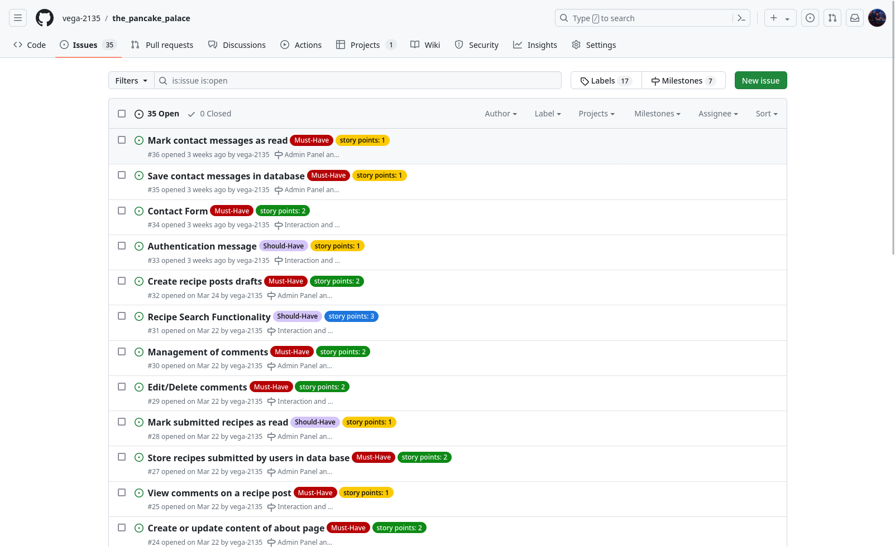
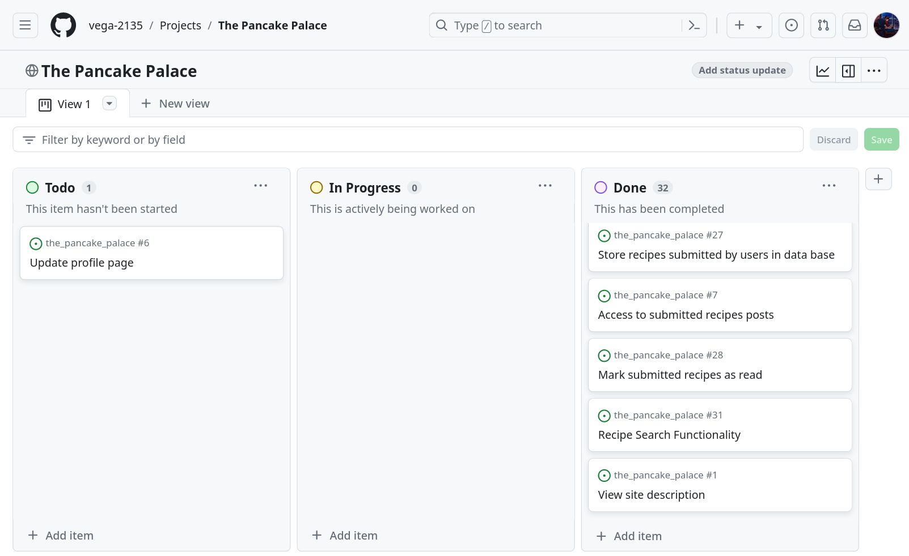
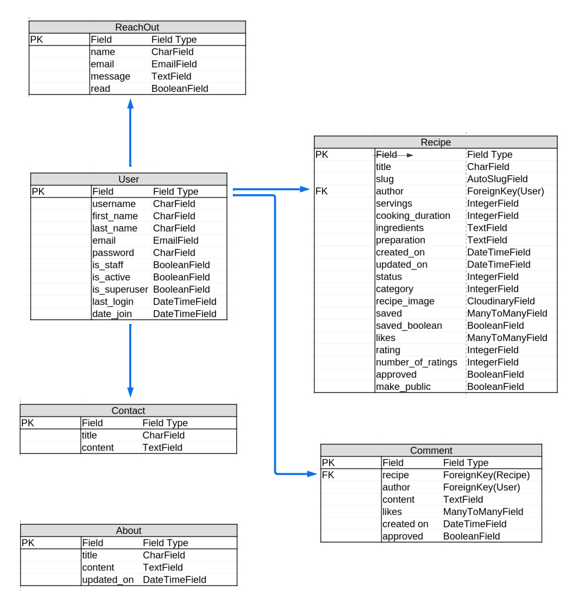

# The Pancake Palace

Welcome to The Pancake Palace, your go-to destination for an array of mouthwatering pancake recipes! Dive into our selection featuring popular classics, delightful options for kids, and delectable vegan alternatives. As a registered user, unleash your culinary creativity by submitting, liking, and rating recipes, alongside leaving comments and contacting the page owner for queries or suggestions. Your contributions await approval by our diligent admin before sharing with fellow pancake enthusiasts. Easily submit your own recipes via a user-friendly form, with the flexibility to edit or delete them as desired. Keep track of your favorite finds with our handy saved recipe feature, and revisit your culinary creations on your personal submissions page. Experience pancake perfection, one recipe at a time, at The Pancake Palace!

[The deployed website can be found here](https://vjp-recipe-book-821f4ac9817f.herokuapp.com/)

## Contents

1. [User Experience (UX)](#1-user-experience-ux)
2. [Agile Development](#2-agile-development)
3. [Design](#3-design)
4. [Features](#4-features)
5. [Technologies Used](#5-technologies-used)
6. [Local Development and Deployment](#6-local-development-and-deployment)
7. [Testing](#7-testing)
8. [Credits](#8-credits)

## 1. User Experience (UX)

### User Stories

User stories were generated through [GitHub Issues](https://github.com/vega-2135/the_pancake_palace/issues), with story points assigned based on estimated task completion times. Milestones and appropriate tags were also applied for organization.

Explore the user stories below in the section labeled [User Story Testing(), and delve deeper into comprehensive details, including screenshots, story points, milestones, and tags, by visiting [GitHub Issues](https://github.com/vega-2135/the_pancake_palace/issues).

## 2. Agile Development

The project development at The Pancake Palace was guided by Agile principles, allowing iterative and incremental enhancements to the projects's design throughout its evolution. leveraging GitHub's robust features to implement Scrum methodology effectively.GitHub Issues served as the backbone of the product backlog, housing detailed user stories. GitHub Issues' tagging feature was used to assign story points, prioritize features using the MoSCoW method, and categorize user stories for streamlined development. Additionally, GitHub's Milestones feature aided in sprint planning and deadline setting, ensuring timely delivery of project milestones.

Utilizing GitHub Issues and Projects, I meticulously managed each aspect of my project, organizing them into Epics and further breaking them down into User Stories with associated Tasks. Epics represented significant features, while User Stories were prioritized as mentioned using the MoSCoW technique, ensuring efficient allocation of resources.

GitHub's Project board provided a visual representation of our progress, utilizing a [kanban board](https://github.com/users/vega-2135/projects/2/views/1) approach to track user story development from 'Todo' to 'Done', with each stage signifying the completion of specific development milestones.

Furthermore, GitHub milestones were employed to group related user stories, enhancing project organization and cohesion which additionally aided in sprint planning and deadline setting, ensuring timely delivery of project milestones.

## 3. Design

- ### Structure
The Recipe Book app boasts a straightforward layout, prioritizing user-friendliness and seamless navigation. Its uniform page structure ensures users can effortlessly locate desired information. With a responsive design, the app adapts seamlessly across various devices, guaranteeing clear visibility. All pages show a navigation menu that offers users a consistent means to explore the site's content. Employing CSS and Bootstrap rows and columns, the app maintains a tidy and cohesive content arrangement throughout its pages.

- ### Colour Scheme

The color Light Purple (rgb(171, 196, 255)) was chosen as the background color for the website header and footer, as well as for the listing of ingredients, preparation steps, and borders of card containers. A lighter purple color was used for the background of the text containing the decription of the page in the home page.

The color white was chosen as the background color of the website.

The color black was chosen as the font color for all text on the website, as it provides the best contrast with the white background of the website.

- ### Typography

In crafting the typography for our website, deliberate consideration was given to ensure optimal readability and aesthetic appeal. To achieve this balance, we've selected the versatile and modern Roboto font as the primary typeface throughout the entire site. Renowned for its clean lines, readability, and versatility across various screen sizes and resolutions, Roboto offers a seamless reading experience. Its uniformity and clarity elevate the presentation of content, ensuring that users can effortlessly engage with our platform's offerings. By employing Roboto consistently across all text elements, from headers to paragraphs, I aim to deliver a cohesive and visually pleasing browsing experience to users.

- ### Wireframes
- [Home Page](docs_readme/wireframes/home_page.png)
- [Popular Pancakes](docs_readme/wireframes/popular_pancakes.png)
- [Pancakes for Kids](docs_readme/wireframes/pancakes_for_kids.png)
- [Vegan Pancakes](docs_readme/wireframes/vegan_pancakes.png)
- [About](docs_readme/wireframes/about.png)
- [Share Recipe](docs_readme/wireframes/share_recipe.png)

### Additional
The logo of the website was taken from fontawsome page and converted in a logo using a [favicon generator webapp](https://favicon.io/)

## 4. Database Design
LibreOffice spreadsheet was used for designing the models, followed by integrating them into a single cohesive image using Lucidchart. In this project, the Django User model was used and is incorporated into the image to illustrate its connection with the other project models.

## 5. Features

- ### Home Page
The homepage features a concise overview of the website's purpose alongside the top-rated recipes, enticing visitors with a glimpse of the culinary delights awaiting them. A prominent navigation bar grants seamless access to every corner of the site, ensuring users can easily explore and discover a plethora of delectable dishes and culinary inspirations.

Home Page Screenshot

- ### Navbar
The navbar is designed to adapt to different screen sizes and contains essential features for user navigation. It prominently displays the website logo and incorporates a search box, enabling users to find recipes based on specific keywords. Additionally, there are distinct buttons for user registration and login, facilitating access to enhanced functionality within the site.

Once users register or log in, the register button transforms into a personalized button displaying the user's name. This button offers a dropdown menu with convenient links to saved recipes, submitted recipes, and a page for sharing recipes. Below the aforementioned navbar options, there are five additional options available:

- Three distinct categories of recipes—Popular Pancakes, Pancakes for Kids, and Vegan Pancakes—each leading to dedicated pages containing relevant recipes.
- Links to the 'About' and 'Contact Me' pages, providing users with additional information about the website and a means to get in touch.

This layout ensures that users can easily navigate through the website, explore recipe options, and access essential pages for further engagement or inquiries.

Nav Bar Screenshots

- ### User Authentication
The pancake palace website employs the Django Allauth package to manage user authentication and grant authenticated users access to CRUD functionalities. This package furnishes a suite of views and templates dedicated to user registration, login, and logout processes. Throughout the website, defensive programming techniques have been implemented to safeguard against unauthorized access to pages lacking appropriate permissions. Django's LoginRequired mixin is utilized to restrict access to anonymous users, redirecting them to the login page when attempting to view restricted content, for example only the original author of a recipe can make edits of comments or submitted recipes. Unauthorized attempts trigger redirection to a 403 error page, notifying users of their lack of permission to execute the action. Furthermore, for access to the admin panel, users must hold either 'superuser' or 'staff status' permissions.

User Authentication Screenshots

- ### Upvoting
Registered users can upvote the resources they like, other users will see the total number of likes a recipe has.

Upvoting Screenshots

- ### Save Recipes
Registered users can save any recipe they like. Users can find the saved recipes in the page saved recipes. The users also have the possibility of removing any recipe they have previously saved.

Saved Recipes Screenshots

- ### Rate recipes
Registered users can also rate any recipe when leaving a comment in the comment section of a recipe page. All users can see the average rating and number of people that have rated a recipe at the top of the image in the recipe detail page and also in the bottom of a recipe image in the category pages.

Rating Recipes Screenshots

- ### Leaving comments
Registered users on the website have the ability to leave comments. Upon submitting a comment, a message is displayed informing them that their comment will undergo review before being published. Prior to approval, the author of the comment can preview their submission, displayed in a light grey color. Additionally, users have the option to edit or delete their comments after posting. Of important note, users must rate a recipe before they can submit a comment.

Comment Recipes Screenshots

- ### Submitting recipes
Users with an account on the website can submit recipes after logging in. They can do so by clicking 'Share Recipe' in the dropdown menu accessible under their username. The 'Share Recipe' page features a form with all necessary fields for a successful submission. Once a user submits a recipe, a message appears at the top of the page, informing them that the recipe will undergo review before publication.

Upon opening the published recipe page (after approval and publication by the site admin), the submitting user can edit or delete the recipe. These options are exclusively available to the user who shared the recipe.

All submitted recipes can be found on the 'Submitted Recipes' page.

Submitting Recipes Screenshots

- ### Contact
All users can contact the owner of the website by clicking in the Contact option of the navbar. The can leave a message for comments, questions or suggestions about the site or recipes.

Contact Page Screenshot

- ### About
The About page provides a detailed insight into the mission and purpose of The Pancake Palace website.

About Page Screenshot

- ### Search recipes
Users can effortlessly find recipes by entering keywords into the search box located at the top of the website. Any recipe containing the specified keyword will be promptly listed on a new page, ensuring quick and convenient access to the desired content.

Search Recipes Screenshot

- ### Admin Panel
The Django admin panel is accessible to 'superusers' and users granted the 'staff status' permission. This panel serves as a central hub for managing site content. Each data model is seamlessly integrated into the admin interface using the register decorator. This allows for easy access and management of various functionalities, including adding or removing recipes, reviewing contact messages, setting the approval status of recipes and comments, as well as managing user accounts for cases of inappropriate behavior on the site. Additionally, the admin panel facilitates the addition of descriptions found on the About page.

- ### Footer
The footer contains the copyright information and the icons for facebook, twitter and instagram pages.

Search Recipes Screenshot

- ### Future Features

    - Registration option with google and facebooks accounts.

## 6. Technologies used
### Languages

- [HTML5](https://en.wikipedia.org/wiki/HTML5)
- [CSS3](https://en.wikipedia.org/wiki/CSS)
- [JavaScript](https://en.wikipedia.org/wiki/JavaScript)
- [Python](https://en.wikipedia.org/wiki/Python_(programming_language))

### Frameworks, Libraries and Packages

- [Django 3.2](https://docs.djangoproject.com/en/3.2/)
- [Bootstrap 5](https://getbootstrap.com/)
- [jQuery 3.7.1](https://releases.jquery.com/)
- [Font Awesome 5.15.4](https://fontawesome.com/)
- [Google Fonts](https://fonts.google.com/)
- [django-crispy-forms](https://django-crispy-forms.readthedocs.io/en/latest/)
- [cripsy-bootstrap5](https://github.com/django-crispy-forms/crispy-bootstrap5)
- [django-allauth](https://django-allauth.readthedocs.io/en/latest/)
- [django-dynamic-formset](https://github.com/elo80ka/django-dynamic-formset)
- [django-autoslug](https://django-autoslug.readthedocs.io/en/stable/)
- [django-taggit](https://django-taggit.readthedocs.io/en/stable/)

### Tools

- [Git](https://git-scm.com/)
- [GitHub](https://github.com/)
- [Heroku](https://heroku.com/)
- [ElephantSQL](https://www.elephantsql.com/)
- [Cloudinary](https://cloudinary.com/)
- [Balsamiq](https://balsamiq.com/)
- [Lucidchart](https://www.lucidchart.com/pages)
- [Bulkresizephotos](https://bulkresizephotos.com/en?format=webp&quality=93)
- [favicon.io](https://favicon.io/)
- [The W3C Markup Validation Service](https://validator.w3.org/)
- [The W3C CSS Validation Service](https://jigsaw.w3.org/css-validator/)
- [Code Institute Python Linter](https://pep8ci.herokuapp.com/)
- [JSHint](https://jshint.com/)
- [Firefox DevTools](https://developer.chrome.com/docs/devtools/)
