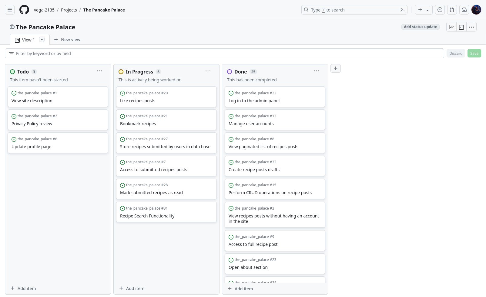

# The Pancake Palace

Welcome to The Pancake Palace, your go-to destination for an array of mouthwatering pancake recipes! Dive into our selection featuring popular classics, delightful options for kids, and delectable vegan alternatives. As a registered user, unleash your culinary creativity by submitting, liking, and rating recipes, alongside leaving comments and contacting the page owner for queries or suggestions. Your contributions await approval by our diligent admin before sharing with fellow pancake enthusiasts. Easily submit your own recipes via a user-friendly form, with the flexibility to edit or delete them as desired. Keep track of your favorite finds with our handy saved recipe feature, and revisit your culinary creations on your personal submissions page. Experience pancake perfection, one recipe at a time, at The Pancake Palace!


[The deployed website can be found here](https://vjp-recipe-book-821f4ac9817f.herokuapp.com/)

## Contents

1. [User Experience (UX)](#1-user-experience-ux)
2. [Agile Development](#2-agile-development)
3. [Design](#3-design)
4. [Features](#4-features)
5. [Technologies Used](#5-technologies-used)
6. [Local Development and Deployment](#6-local-development-and-deployment)
7. [Testing](#7-testing)
8. [Credits](#8-credits)

## 1. User Experience (UX)

### User Stories

User stories were generated through [GitHub Issues](https://github.com/vega-2135/the_pancake_palace/issues), with story points assigned based on estimated task completion times. Milestones and appropriate tags were also applied for organization.

Explore the user stories below in the section labeled [User Story Testing(), and delve deeper into comprehensive details, including screenshots, story points, milestones, and tags, by visiting [GitHub Issues](https://github.com/vega-2135/the_pancake_palace/issues).

## 2. Agile Development

The project development at The Pancake Palace was guided by Agile principles, allowing iterative and incremental enhancements to the projects's design throughout its evolution. leveraging GitHub's robust features to implement Scrum methodology effectively.GitHub Issues served as the backbone of the product backlog, housing detailed user stories. GitHub Issues' tagging feature was used to assign story points, prioritize features using the MoSCoW method, and categorize user stories for streamlined development. Additionally, GitHub's Milestones feature aided in sprint planning and deadline setting, ensuring timely delivery of project milestones.

Utilizing GitHub Issues and Projects, I meticulously managed each aspect of my project, organizing them into Epics and further breaking them down into User Stories with associated Tasks. Epics represented significant features, while User Stories were prioritized as mentioned using the MoSCoW technique, ensuring efficient allocation of resources.

GitHub's Project board provided a visual representation of our progress, utilizing a [kanban board](https://github.com/users/vega-2135/projects/2/views/1) approach to track user story development from 'Todo' to 'Done', with each stage signifying the completion of specific development milestones.


Furthermore, GitHub milestones were employed to group related user stories, enhancing project organization and cohesion which additionally aided in sprint planning and deadline setting, ensuring timely delivery of project milestones.




## 3. Design

- ### Structure
The Recipe Book app boasts a straightforward layout, prioritizing user-friendliness and seamless navigation. Its uniform page structure ensures users can effortlessly locate desired information. With a responsive design, the app adapts seamlessly across various devices, guaranteeing clear visibility. All pages show a navigation menu that offers users a consistent means to explore the site's content. Employing CSS and Bootstrap rows and columns, the app maintains a tidy and cohesive content arrangement throughout its pages.


- ### Colour Scheme

The color Light Purple (rgb(171, 196, 255)) was chosen as the background color for the website header and footer, as well as for the listing of ingredients, preparation steps, and borders of card containers. A lighter purple color was used for the background of the text containing the decription of the page in the home page.

The color white was chosen as the background color of the website.

The color black was chosen as the font color for all text on the website, as it provides the best contrast with the white background of the website.

- ### Typography

In crafting the typography for our website, deliberate consideration was given to ensure optimal readability and aesthetic appeal. To achieve this balance, we've selected the versatile and modern Roboto font as the primary typeface throughout the entire site. Renowned for its clean lines, readability, and versatility across various screen sizes and resolutions, Roboto offers a seamless reading experience. Its uniformity and clarity elevate the presentation of content, ensuring that users can effortlessly engage with our platform's offerings. By employing Roboto consistently across all text elements, from headers to paragraphs, I aim to deliver a cohesive and visually pleasing browsing experience to users.

- ### Wireframes
- [Home Page](docs_readme/wireframes/home_page.png)
- [Popular Pancakes](docs_readme/wireframes/popular_pancakes.png)
- [Pancakes for Kids](docs_readme/wireframes/pancakes_for_kids.png)
- [Vegan Pancakes](docs_readme/wireframes/vegan_pancakes.png)
- [About](docs_readme/wireframes/about.png)
- [Share Recipe](docs_readme/wireframes/share_recipe.png)

### Additional
The logo of the website was taken from fontawsome page and converted in a logo using a [favicon generator webapp](https://favicon.io/)


## 4. Database Design
LibreOffice spreadsheet was used for designing the models, followed by integrating them into a single cohesive image using Lucidchart. In this project, the Django User model was used and is incorporated into the image to illustrate its connection with the other project models.


## 5. Features

- ### Home Page
The homepage features a concise overview of the website's purpose alongside the top-rated recipes, enticing visitors with a glimpse of the culinary delights awaiting them. A prominent navigation bar grants seamless access to every corner of the site, ensuring users can easily explore and discover a plethora of delectable dishes and culinary inspirations.

<details>
<summary>Home Page Screenshot</summary>


</details>

- ### Navbar
The navbar is designed to adapt to different screen sizes and contains essential features for user navigation. It prominently displays the website logo and incorporates a search box, enabling users to find recipes based on specific keywords. Additionally, there are distinct buttons for user registration and login, facilitating access to enhanced functionality within the site.

Once users register or log in, the register button transforms into a personalized button displaying the user's name. This button offers a dropdown menu with convenient links to saved recipes, submitted recipes, and a page for sharing recipes. Below the aforementioned navbar options, there are five additional options available:

- Three distinct categories of recipes—Popular Pancakes, Pancakes for Kids, and Vegan Pancakes—each leading to dedicated pages containing relevant recipes.
- Links to the 'About' and 'Contact Me' pages, providing users with additional information about the website and a means to get in touch.

This layout ensures that users can easily navigate through the website, explore recipe options, and access essential pages for further engagement or inquiries.

<details>
<summary>Nav Bar Screenshots</summary>


</details>

- ### User Authentication
The pancake palace website employs the Django Allauth package to manage user authentication and grant authenticated users access to CRUD functionalities. This package furnishes a suite of views and templates dedicated to user registration, login, and logout processes. Throughout the website, defensive programming techniques have been implemented to safeguard against unauthorized access to pages lacking appropriate permissions. Django's LoginRequired mixin is utilized to restrict access to anonymous users, redirecting them to the login page when attempting to view restricted content, for example only the original author of a recipe can make edits of comments or submitted recipes. Unauthorized attempts trigger redirection to a 403 error page, notifying users of their lack of permission to execute the action. Furthermore, for access to the admin panel, users must hold either 'superuser' or 'staff status' permissions.

<details>
<summary>User Authentication Screenshots</summary>


</details>

- ### Upvoting
Registered users can upvote the resources they like, other users will see the total number of likes a recipe has.

<details>
<summary>Upvoting Screenshots</summary>


</details>

- ### Save Recipes
Registered users can save any recipe they like. Users can find the saved recipes in the page saved recipes. The users also have the possibility of removing any recipe they have previously saved.

<details>
<summary>Saved Recipes Screenshots</summary>


</details>

- ### Rate recipes
Registered users can also rate any recipe when leaving a comment in the comment section of a recipe page. All users can see the average rating and number of people that have rated a recipe at the top of the image in the recipe detail page and also in the bottom of a recipe image in the category pages.

<details>
<summary>Rating Recipes Screenshots</summary>


</details>

- ### Leaving comments
Registered users on the website have the ability to leave comments. Upon submitting a comment, a message is displayed informing them that their comment will undergo review before being published. Prior to approval, the author of the comment can preview their submission, displayed in a light grey color. Additionally, users have the option to edit or delete their comments after posting. Of important note, users must rate a recipe before they can submit a comment.

<details>
<summary>Comment Recipes Screenshots</summary>


</details>

- ### Submitting recipes
Users with an account on the website can submit recipes after logging in. They can do so by clicking 'Share Recipe' in the dropdown menu accessible under their username. The 'Share Recipe' page features a form with all necessary fields for a successful submission. Once a user submits a recipe, a message appears at the top of the page, informing them that the recipe will undergo review before publication.

Upon opening the published recipe page (after approval and publication by the site admin), the submitting user can edit or delete the recipe. These options are exclusively available to the user who shared the recipe.

All submitted recipes can be found on the 'Submitted Recipes' page.

<details>
<summary>Submitting Recipes Screenshots</summary>


</details>

- ### Contact
All users can contact the owner of the website by clicking in the Contact option of the navbar. The can leave a message for comments, questions or suggestions about the site or recipes.

<details>
<summary>Contact Page Screenshot</summary>


</details>

- ### About
The About page provides a detailed insight into the mission and purpose of The Pancake Palace website.

<details>
<summary>About Page Screenshot</summary>


</details>

- ### Search recipes
Users can effortlessly find recipes by entering keywords into the search box located at the top of the website. Any recipe containing the specified keyword will be promptly listed on a new page, ensuring quick and convenient access to the desired content.

<details>
<summary>Search Recipes Screenshot</summary>


</details>

- ### Admin Panel
The Django admin panel is accessible to 'superusers' and users granted the 'staff status' permission. This panel serves as a central hub for managing site content. Each data model is seamlessly integrated into the admin interface using the register decorator. This allows for easy access and management of various functionalities, including adding or removing recipes, reviewing contact messages, setting the approval status of recipes and comments, as well as managing user accounts for cases of inappropriate behavior on the site. Additionally, the admin panel facilitates the addition of descriptions found on the About page.

- ### Footer
The footer contains the copyright information and the icons for facebook, twitter and instagram pages.

<details>
<summary>Search Recipes Screenshot</summary>


</details>

- ### Future Features

    - Registration option with google and facebooks accounts.

## 6. Technologies used
### Languages

- [HTML5](https://en.wikipedia.org/wiki/HTML5)
- [CSS3](https://en.wikipedia.org/wiki/CSS)
- [JavaScript](https://en.wikipedia.org/wiki/JavaScript)
- [Python](https://en.wikipedia.org/wiki/Python_(programming_language))

### Frameworks, Libraries and Packages

- [Django 4.2.1](https://docs.djangoproject.com/en/3.2/)
- [Bootstrap 5](https://getbootstrap.com/)
- [jQuery 3.7.1](https://releases.jquery.com/)
- [Font Awesome 6.5.2](https://fontawesome.com/)
- [Google Fonts](https://fonts.google.com/)
- [django-crispy-forms](https://django-crispy-forms.readthedocs.io/en/latest/)
- [cripsy-bootstrap5](https://github.com/django-crispy-forms/crispy-bootstrap5)
- [django-allauth](https://django-allauth.readthedocs.io/en/latest/)
- [django-dynamic-formset](https://github.com/elo80ka/django-dynamic-formset)
- [django-autoslug](https://django-autoslug.readthedocs.io/en/stable/)
- [django-taggit](https://django-taggit.readthedocs.io/en/stable/)

### Tools

- [GitHub:](https://github.com/) used for version control, collaborative development and code management.

- [Google Fonts:](https://fonts.google.com/) used to import and apply a variety of fonts to enhance the visual appeal of the website.

- [VSCode (Visual Studio Code):](https://code.visualstudio.com/) used for writing, editing, and debugging the code for this webapp.

- [Techsini:](https://techsini.com/multi-mockup/) used to create mockup images of home page in different devices (phone, ipad, laptop, desktop).

- [Balsamiq:](https://balsamiq.com/) used to generate wireframes of the page.

- [Heroku:](https://dashboard.heroku.com/) used for the deployment of the application.

- [Lucid Chart:](https://www.lucidchart.com/) used for making a flow chart of the project models.

- [ElephantSQL](https://www.elephantsql.com/) used for storing and managing the project database.

- [Cloudinary](https://cloudinary.com/) used for storing images uploaded by users.

- [Bulkresizephotos](https://bulkresizephotos.com/en?format=webp&quality=93) used for changing extension and size of the recipe's images.

- [favicon.io](https://favicon.io/) used for the logo of the website.

- [The W3C Markup Validation Service](https://validator.w3.org/) used to validate code in html files.

- [The W3C CSS Validation Service](https://jigsaw.w3.org/css-validator/) used to validate css code.

- [Code Institute Python Linter](https://pep8ci.herokuapp.com/) used to validate code in .py files.

- [JSHint](https://jshint.com/) sed to validate javascript code.

- [Firefox DevTools](https://developer.chrome.com/docs/devtools/) used for debugging of css code.

## .7 Testing
- ### Manual Testing
I conducted ongoing manual testing throughout the development stages of the project to ensure its functionality and performance met the desired standards.

Additionally, I enlisted the help of friends to rigorously test various features such as account registration, submitting, editing, and deleting comments and recipes. Their feedback was instrumental in identifying and addressing any potential issues or bugs within the system.

- ### User Story Testing

<details>
<summary>As a first time visitor I want to encounter a concise description of the website upon arrival to understand its purpose.</summary>

### Acceptance Criteria

- Given a unregistered user, they are greeted at the home page with a message stating the purpose of the website.


**Result:** ✅ Pass
</details>

<details>
<summary>As a first time visitor to the site, I can review the Privacy Policy before registering, ensuring transparency regarding the handling of my data.</summary>

### Acceptance Criteria

- Given a unregistered user, they can access the Privacy Policy by clicking on a designated link.
- The Privacy Policy is written in clear and understandable language.


**Result:** ✅ Pass
</details>

<details>
<summary>As a user, I can register for an account to enable interaction with the site.</summary>

### Acceptance Criteria

- Given a user, they can browse the site without logging in.
- Given a user, they have the option to register for an account.


**Result:** ✅ Pass
</details>

<details>
<summary>As a first time visitor of the site I can register using my Google or Facebook accounts so that I can signup without completing any forms.</summary>

### Acceptance Criteria

- Given a unregistered user, they are provided with the choice to sign up using their Google or Facebook accounts.
- Given an unregistered user, upon selecting the Google or Facebook sign-in options, an account is automatically created for them.


**Result:** ✅ Pass
</details>

<details>
<summary>As a first-time visitor, I want a clear explanation of the advantages of being a registered user so that I can decide if I want to create an account on the site.</summary>

### Acceptance Criteria

- Given a first time visitor, upon being redirected to the sign-in page after clicking the register button, an explanation appears below the 'Sign in' title stating the advantages of having an account.


**Result:** ✅ Pass
</details>

<details>
<summary>As a registered user, I can update my profile page so that I can provide links to my Facebook, Instagram, and Twitter accounts, enabling others to find and connect with me on these platforms.</summary>

### Acceptance Criteria

- Given a logged-in user, they can add Facebook, Instagram, and Twitter links to their profile.
- Given a logged-in user, they can edit the contents of their profile.
- Given a logged-in user, they can delete their account.


**Result:** ✅ Pass
</details>

</details>

<details>
<summary>As a registered user, I want to have access to a comprehensive list of the recipes I've submitted so that I can review all my submissions on a single page.</summary>

### Acceptance Criteria

- Given a logged in user, they can read in one page all the recipes they have submitted.


**Result:** ✅ Pass
</details>

<details>
<summary>As a registered user, I can access to a paginated list of recipes, facilitating easy navigation without the need for endless scrolling, thereby enabling efficient selection of desired recipes.</summary>

### Acceptance Criteria

- Given multiple posts in the database, all of them are displayed.
- Upon opening the main page, the user should encounter a list of recipes.
- The user should then see all recipe titles with pagination for convenient selection of what to read.


**Result:** ✅ Pass
</details>

<details>
<summary>As a user, I can click on a recipe post so that I can read the full recipe.</summary>

### Acceptance Criteria

- When a recipe post title is clicked on a detailed view of the recipe is seen. 


**Result:** ✅ Pass
</details>


<details>
<summary>As a registered user, I have the ability to rate recipes so that I can convey to the recipe owner my opinion on the quality of their recipe.</summary>

### Acceptance Criteria

- Given a logged in user, they can click on a number of starts corresponding to their opinion of the recipe's quality.
- Depending on the number of stars the users give to a recipe, that number of stars should change their color upon clicking on them, to provide visual feedback on the given rating. 


**Result:** ✅ Pass
</details>

<details>
<summary>As a user, I want to receive feedback messages upon registering and each time I log in or out of the site, providing assurance that the registration or login process was successful.</summary>

### Acceptance Criteria

- Given a user, after they click the register button, a welcome message appears at the top of the website.
- Given a user, after they log in and out of the website, a message pops up stating that they have logged in or out of the website.


**Result:** ✅ Pass
</details>

<details>
<summary>As a user, I want to receive a feedback message upon commenting on a recipe post, ensuring acknowledgment of my comment submission.</summary>

### Acceptance Criteria

- Given a logged in user, after they click 'submit' in the comment section, a message should pop-outs, informing them that the comment has been received and that approval is pending.


**Result:** ✅ Pass
</details>

<details>
<summary>As a Site Admin, I can manage user accounts by adding and removing them, ensuring control over site access and user privileges.</summary>

### Acceptance Criteria

- Given a logged in admin user, they can create a new user account.
- Given a logged in admin user, they can remove an existent user account.


**Result:** ✅ Pass
</details>

<details>
<summary>As a Site Admin, I can manually review and either approve or reject user-submitted recipes and comments, allowing me to moderate the site and maintain a spam-free and respectful environment.</summary>

### Acceptance Criteria

- When a user submits a recipe or comment, it is presented in the admin panel for review.
- The admin can approve or reject the recipe or comment for publication.


**Result:** ✅ Pass
</details>

<details>
<summary>As a Site Admin, I have the capability to perform CRUD (Create, Read, Update, Delete) operations on recipes posts, allowing me to effectively manage website content.</summary>

### Acceptance Criteria

- Given a logged in admin user, they can create a recipe post
- Given a logged in admin user, they can read a recipe post
- Given a logged in admin user, they can update a recipe post
- Given a logged in admin  user, they can delete a recipe post

**Result:** ✅ Pass
</details>

<details>
<summary>As a user, I have the ability to preview a thumbnail of the site, enabling me to preview its content before clicking.</summary>

### Acceptance Criteria

- Thumbnails of each recipe post are visible.
- Clicking on a thumbnail redirects the user to the page containing the complete recipe.

**Result:** ✅ Pass
</details>

<details>
<summary>As a user, I can browse recipes by category, facilitating the discovery of content that aligns with my interests.</summary>

### Acceptance Criteria

- Given a user, they can view multiple categories of recipes.
- Upon selecting a category, only recipes belonging to that category are displayed.

**Result:** ✅ Pass
</details>

<details>
<summary>As a Site User, I can register an account so that I can engage with recipe posts by commenting, liking, and submitting recipes.</summary>

### Acceptance Criteria

- A user can register an account by filling in the registration form.
- The user is then able to log in.
- Upon logging in, the user can interact with recipe posts by commenting, liking, and submitting recipes.

**Result:** ✅ Pass
</details>

<details>
<summary>As a registered user, I can submit new recipes so that other users can see them on the site.</summary>

### Acceptance Criteria

- Given a registered user, they can submit recipes to the site. These submissions should be approved by the site admin before becoming visible to other users on the website.

**Result:** ✅ Pass
</details>

<details>
<summary>As a registered user, I can indicate my preference for recipes by 'liking' them, enabling the website owner to identify the most popular recipes.</summary>

### Acceptance Criteria

- Given a logged in user, they can click a button to indicate that they like a recipe.
- The 'liked' icon changes colors when they click on it.

**Result:** ✅ Pass
</details>


<details>
<summary>As a registered user, I have the capability to bookmark recipes, allowing me to create a list of my favorite recipes for future reference.</summary>

### Acceptance Criteria

- Given a logged in user, they can click a bookmark icon located next to each recipe.
- The selected recipe are then added to their list of bookmarked recipes.
- Given a logged in user, they can access a page where they can view all their bookmarked recipes.

**Result:** ✅ Pass
</details>

<details>
<summary>As a site admin, I want to securely log in to the admin panel, ensuring access to the site's administrative features.</summary>

### Acceptance Criteria

- Given a logged in admin user, they can successfully log in to the admin panel.

**Result:** ✅ Pass
</details>

<details>
<summary>As a Site User, I can access the information about the site by clicking on the About link.</summary>

### Acceptance Criteria

- Given a user, when they click the About link, they are redirected to the About page.

**Result:** ✅ Pass
</details>

<details>
<summary>As a Site Admin, I can create or update the content of the about page, ensuring it is available on the site.</summary>

### Acceptance Criteria

- The About app is visible and accessible within the admin panel.

**Result:** ✅ Pass
</details>

<details>
<summary>As a registered user, I can view comments on an individual post so that I can see what other people think about the recipe.</summary>

### Acceptance Criteria

- Given one or more user comments any registered user can view them.

**Result:** ✅ Pass
</details>

<details>
<summary>As a Site Owner I can store shared recipes in the database so that I can review them at any time.</summary>

### Acceptance Criteria

- After the user fills in the 'share a recipe' form, the data is sent to the database for the site admin’s review and potential posting on the website.

**Result:** ✅ Pass
</details>

<details>
<summary>As a site admin, I can mark shared recipes as 'read' so that I can track the progress of their processing and addition to of the website.</summary>

### Acceptance Criteria

- Given a site admin, they can mark any shared recipe as read. 

**Result:** ✅ Pass
</details>

<details>
<summary>As a registered user I can modify or delete my comment on a recipe post so that I can be involved in the conversation.</summary>

### Acceptance Criteria

- Given a logged in user, they can modify their comment.
- Given a logged in user, they can delete their comment.

**Result:** ✅ Pass
</details>

<details>
<summary>As a Site Admin I can approve or disapprove comments so that I can filter out objectionable content.</summary>

### Acceptance Criteria

- Given a logged in user, they can approve a comment.
- Given a logged in user, they can reject a comment.
**Result:** ✅ Pass
</details>

<details>
<summary>As a Site User, I want to be able to search for recipes by keywords, so that I can quickly find recipes that match my preferences.</summary>

### Acceptance Criteria

- The search functionality allows users to enter keywords related to recipes.
- Upon entering keywords and initiating the search, relevant recipe posts matching the keywords are displayed.
- The search results are presented in a clear and organized manner, facilitating easy navigation for users.
**Result:** ✅ Pass
</details>

<details>
<summary>As a User I can fill in a contact form so that I can reach out the owner of the page for comments, insights or suggestions about the page.</summary>

### Acceptance Criteria

- Given a logged in user, upon filling out the contact form and clicking the submit button, their message will be sent to the owner of the website.
- When the message is submitted a notification at the top of the page will appear informing the user that their message was received.
**Result:** ✅ Pass
</details>


<details>
<summary>As a Site Owner I can store contact messages in the database so that I can review them. </summary>

### Acceptance Criteria

- Given a logged-in admin user, once a user has sent a contact message, the admin user can review the message in the admin panel.
**Result:** ✅ Pass
</details>

<details>
<summary>As a Site Owner I can mark contact messages as "read" so that I can see how many I still need to review.  </summary>

### Acceptance Criteria

- Given a logged-in admin user, when a contact message appears in the admin panel, the admin user is able to review it and mark the message as read, indicating that it has been reviewed.
**Result:** ✅ Pass
</details>

- ### Automated Testing
Automates tests where performed using Django's built-in testing framework which use Python's unittest module. The tests can be found in each app directory.

- ### Code Validation
- #### Html code validation
The W3C Markup Validation Service was used to validate all HTML files, ensuring adherence to web standards. The majority of pages passed validation with no errors. However, pages containing forms and dynamically generated content, such as the About page edited via the admin panel, exhibited occasional deprecated tags, prompting suggestions to use CSS alternatives instead.


- #### CSS code validation


- #### JavaScript code validation


- #### Python code validation
The Code Institute Python Linter was used to validate and format the python files correctly. All errors were fixed and no errors were found in the final tests.


- ### Challenges Faced

## 8. Deployment
### 1. Forking the Repository

- Log in to GitHub.
- Go to the repository for this project (<https://github.com/VictoriaParkes/recipe-book>).
- In the top-right corner of the page, click "Fork".
- Under "Owner", select an owner for the repository from the dropdown menu.
- Optionally, in the "Description" field, type a description of your fork.
- To copy the main branch only, select the "Copy the main branch only" check box. If you do not select this option, all branches will be copied into the new fork.
- Click "Create fork"

### 2. Cloning Your Forked Repository

- Log-in to GitHub.com, navigate to your fork of the repository.
- Above the list of files, click Code.
- Copy the URL for the repository.
  - To clone the repository using HTTPS, under "Clone with HTTPS", click the "Copy" icon.
  - To clone the repository using an SSH key, including a certificate issued by your organization's SSH certificate authority, click SSH, then click the "Copy" icon.
  - To clone a repository using GitHub CLI, click Use GitHub CLI, then click the "Copy" icon.
- Open Git Bash
- Change the current working directory to the location where you want the cloned directory.
- Type git clone, and then paste the URL you copied earlier.
- Press Enter. Your local clone will be created.

For more details about forking and cloning a repository, please refer to [GitHub documentation](https://docs.github.com/en/get-started/quickstart/fork-a-repo).

### 3. Install Dependencies

Use the `pip install -r requirements.txt` command to install all of the Python modules and packages listed in your requirements.txt file.

### 4. List of Requirements:
- Open your terminal and run the command pip3 freeze > requirements.txt to generate a list of dependencies.
- Commit the changes and push them to your GitHub repository.

### 5. Create your env.py

- In your project workspace, create a file called env.py and make sure this file is included in the .gitignore file.
- Add the following code:

```python
import os

os.environ["DATABASE_URL"]='<copiedURL>'
os.environ['SECRET_KEY'] = '<ADD YOUR SECRET KEY HERE>'
os.environ['CLOUDINARY_URL'] = '<API ENVIRONEMENT VARIABLE>'

```

- Replace `<ADD YOUR SECRET KEY HERE>` in the SECRET_KEY environment variable with your own secret key.
- Save the file.

### 6. Create a Database

- Create an account and log in with ElephantSQL.com.
- From the dashboard click “Create New Instance”.
- Set up your plan
  - Give your plan a Name
  - Select a plan tier
  - You can leave the Tags field blank
- Select “Select Region”
- Select a data center near you
- Then click “Review”
- Check your details are correct and then click “Create instance”
- Return to the ElephantSQL dashboard and click on the database instance name for this project
- In the URL section, click the copy icon to copy the database URL
- In your env.py file replace `<copiedURL>` in the DATABASE_URL environment variable with the copied URL.
- Save the file.

#### 7. Set Up Cloudinary

- Create an account and log in with Cloudinary.com.
- In the dashboard copy your API Environment variable.
- In your env.py file replace `<API ENVIRONEMENT VARIABLE>` in the CLOUDINARY_URL environment variable with the copied API Environment variable.
- Save the file.


### 8. Heroku Account Setup:
- Create an account in Heroku (if you don't have one).
- Navigate to the Heroku dashboard and click on the "Create new app" button.
- Choose a unique name for your app, select the region, and then click "Create app".

### 9. Configuring Environment Variables:
- Open the app settings and click on the "Reveal Config Vars" button.
- Add a key-value pair:
    - Key: PORTCLOUDINARY_URL
    - Value:  	paste your API Environment variable copied from the Cloudinary dashboard
- Click "Add".
- Add another key-value pair:
    - Key: DATABASE_URL
    - Value: paste the URL copied from ElephantSQL dashboard
- Click "Add".
- Add another key-value pair:
    - Key: SECRET_KEY
    - Value: paste your secret key
- Click "Add".

### 10. Deployment Configuration:
- Go to the "Deploy" tab in settings.
- Choose the deployment method as GitHub.
- Connect your Heroku app to your GitHub repository.
- Search for the GitHub repository name and click "connect".
- You can select the option automatic deploys, which enables any change in the chosen branch to be automatically deployed to the app.
- On manual deploy click "Deploy Branch"
- After a few seconds this message appears: "Your app was successfully deployed."
- Click on "view" to open the website containing the command line application.

## 9. Credits

### Code

- I used the Python Essentials template from Code Institute as the foundation and personalized both the HTML and CSS components.

- Code from Code Institute's CodeStar blog walkthrough project was used and modified accordingly.

- For writting the code for the rating functionality I used the rsources mentioned in the following pages:
    - https://freefrontend.com/bootstrap-star-ratings/
    - https://bbbootstrap.com/snippets/bootstrap-rate-your-experience-template-star-ratings-30972576
    
### Images 

- For most of the recipe images, phtoleap mobile app was used for creating the images. 

- Pexels was used for the image in the description section of the homepage
[Image](https://www.pexels.com/photo/pancakes-on-plate-2105104/)

- Error pages:
[400 and 404 Error Pages Image](https://www.freepik.com/free-vector/404-error-background-flat-style_1825302.htm#query=404%20background&position=25&from_view=keyword&track=ais&uuid=a5621bc7-ebb8-4dab-b635-d6a2928c04fa)

[403 Error Page Image](https://www.freepik.com/free-vector/403-error-forbidden-with-police-concept-illustration_7938324.htm#fromView=search&page=1&position=1&uuid=e30b37c7-600d-46ca-8b16-4f27f3ccc261)

[500 Error Page Image](https://www.freepik.com/free-vector/data-scientist-data-analytics-manager-database-developer-administrator-working-big-data-job-database-developers-careers-big-data-concept_11667700.htm#fromView=image_search_similar&page=1&position=52&uuid=8390b579-7d08-4305-8972-36e5c14ddec5)

##  Acknowledgement

I'd like to thank my mentor Brian Macharia, for his invaluable guidance, feedback, tips, and the shared resources. 
